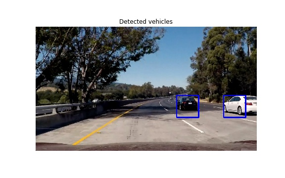

# Vehicle Detection

## Overview
This repository contains the work I did within **Project #5 of Udacity's Self-Driving Car Nanodegree Program**. Objective of the project is to detect the cars in a video from a front-facing camera on a car, using **Computer Vision** and **Machine learning** techniques.

*An example of achieved car detection*

The Project
---

The project involves two distinct steps:

*  Train a classifier to detect the presence of a vehicle using a labeled training set of images. This is split in two steps:
	* Extract features from the image using Computer Vision techniques, like Histogram of Oriented Gradients (HOG).
	* Train a classifier (SVM)
* Detect vehicles in an image using previously trained classifier. 
	* This is done by implementing a sliding-window approach to split image into small batches of different sizes where we search for vehicle using previously trained classifier
	* Build a heat map of vehicle detections so as to reject outliers 
	* Draw bounding box for detected vehicles
	* Estimate a bounding box for vehicles detected.

## Repository content

The repository includes the following files:

* _image\_pipeline.ipynb_ : a jupyter notebook of the pipeline to process images
* _video\_pipeline.ipynb_ : a jupyter notebook of the pipeline to process videos
* _pipeline\_functions.py_ : functions called by the two previous pipelines
* _writeup.md_ : work writeup

And three directories:

* _/images_: images displayed in the report
* _/videos_: videos of the detected vehicles
* _/param_: parameters used for image undistortion and parameters of the classifier

## Dependencies

This lab requires the [CarND Term1 Starter Kit](https://github.com/udacity/CarND-Term1-Starter-Kit).

The lab environment can be created with CarND Term1 Starter Kit. Click [here](https://github.com/udacity/CarND-Term1-Starter-Kit/blob/master/README.md) for the details.

