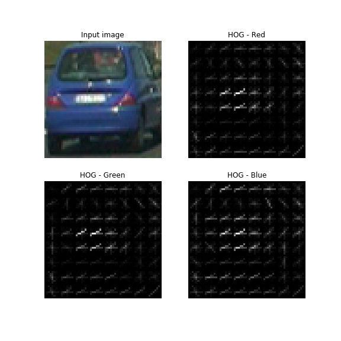
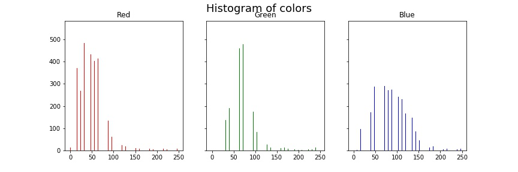
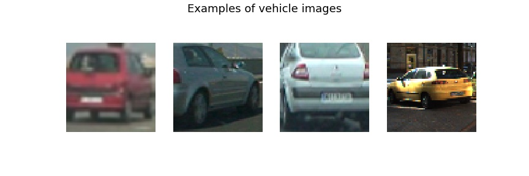
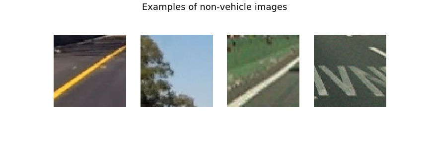
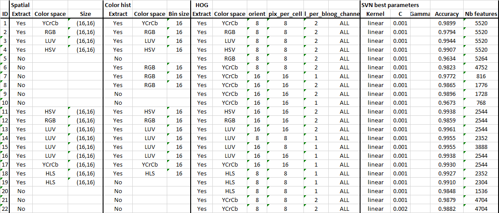
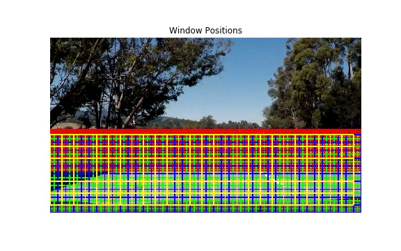

# **Vehicle Detection Project**

Objective of this project is to detect the cars in a video from a front-facing camera on a car, using **Computer Vision** and **Machine learning** techniques.

The project involves two distinct steps:

*  Train a classifier to detect the presence of a vehicle using a labeled training set of images. This is split in two steps:
	* Extract features from the image using Computer Vision techniques, like Histogram of Oriented Gradients (HOG).
	* Train a classifier. Here we used Linear SVM.
* Detect vehicles in an image using previously trained classifier. 
	* This is done by implementing a sliding-window approach to split image into small batches of different sizes where we search for vehicle using previously trained classifier
	* Build a heat map of vehicle detections so as to reject outliers 
	* Draw bounding box for detected vehicles

This writeup is split into five parts:

* Description of extracted features
* Description of classifier
* Description of the pipeline and presentation of results on test images
* Description of additional features brought to pipeline for video processing, and presentation of results
* Discussion of weaknesses and suggested improvements

---
## Feature extraction

Features describe the characteristics of an object, and with images, it really all comes down to intensity and gradients of intensity, and how these features capture the color and shape of an object. 

In class we were presented three different types of features :

* raw pixel values
* histogram of colors  
* histogram of oriented gradients (HOG)

  Below we recall in what HOG consists (extraction from wikipedia [page](https://en.wikipedia.org/wiki/Histogram_of_oriented_gradients)):
> The image is divided into small connected regions called cells, and for the pixels within each cell, a histogram of gradient directions is compiled. The descriptor is the concatenation of these histograms. For  improved accuracy, the local histograms can be contrast-normalized by  calculating a measure of the intensity across a larger region of the image, called a block, and then using this value to normalize all cells within the block. This normalization results in better invariance to changes in illumination and shadowing.

HOG appears to be a very efficient feature to represent shape of objects.

**Color space**

Input image is provided in the RGB color space. This color space may not be the more suitable for feature extraction. Many different color spaces have been defined (see [here](https://en.wikipedia.org/wiki/List_of_color_spaces_and_their_uses)) which are appropriate for different uses. Thus image may be converted to a different color space before feature extraction.
I made trials with the following color spaces: RGB, HSV, HLS, LUV, YCrCb.

The code for feature extractions can be found in the file  `pipeline_functions.py`, within the following functions:
* `bin_spatial()` extract raw pixels. It takes as input parameter the size of the output image
* `color_hist()` computes histogram of colors. It takes as inputs the number of bins (32 by default) and the range (0-255 by default) 
* `get_hog_features()` to compute HOG parameters. This functions calls  the function `hog()` from `skimage` module whose main parameters are: *orientations*,                               *pixels_per_cell*, *cells_per_block* 
* `convert_color()` performs color conversion from to RGB to one of the following color spaces: YCrCb, HSV, HLS, LUV, YUV.  .

Here is an example using the RGB color space and HOG parameters of `orientations=8`, `pixels_per_cell=(8,8)` and `cells_per_block=(2,2)`:

And below we plot the histogam of colors for the same image.

The final choice of parameters was made on the basis of the results of the classifier training (cf. next part).

## Training a classifier

### SVM parameters
SVM is the classifier we will use for this problem as it has been shown to work well on HOG features. We use the python library Scikit-learn (`sklearn`) which provides an exhaustive set of functions related to machine learning.
More information on SVM implementation can be found [here](http://scikit-learn.org/stable/modules/svm.html#svm-classification).
SVM has three hyper parameters that we can tune to minimize the prediction error:

* kernel: ‘linear’, ‘poly’, ‘rbf’, ‘sigmoid’...
* C: Penalty parameter of the error term
* gamma: Kernel coefficient. Only for ‘rbf’, ‘poly’ and ‘sigmoid’ kernels

To sweep through the parameter combinations, we use the function `GridSearchCV()` provided by `sklearn`, which can be set-up in a few lines. Here is the code with the parameters I tested :

     parameters = {'kernel':('linear', 'rbf'), 'C':[0.001, 0.01,0.1], 'gamma':[0.1,1]}
     svr = SVC()
     svc = GridSearchCV(svr, parameters)
     svc.fit(X_train, y_train)

### Image set
The image set is composed of two classes of images: *vehicle* and *non-vehicle* images.  
The images are taken from the [GTI vehicle image database](http://www.gti.ssr.upm.es/data/Vehicle_database.html), the [KITTI vision benchmark suite](http://www.cvlibs.net/datasets/kitti/), and some examples extracted from the project video itself.
The two data sets can be downloaded at the following URLs ([vehicles](https://s3.amazonaws.com/udacity-sdc/Vehicle_Tracking/vehicles.zip),  [non vehicles](https://s3.amazonaws.com/udacity-sdc/Vehicle_Tracking/non-vehicles.zip)).

The total number of images is:

* 8792 for vehicle data set
* 8968 for non-vehicle data set

Here is an example of four of each of the *vehicle* and *non-vehicle* classes:

### Training steps
Training the classifier is done through the following steps:

* read in all the *vehicle* and *non-vehicle* images
* label images (1 for vehicles, 0 for non-vehicles)
* extract features
* normalize features, to zero mean and unit variance, using `StandardScaler` class from `sklearn` (see [link](http://scikit-learn.org/stable/modules/generated/sklearn.preprocessing.StandardScaler.html))
* shuffle data set and split between training and testing sets (80/20%), using `train_test_split` function (provided by `sklearn`)
* train data for the different combinations of parameters
* assess accuracy on test set

Regarding feature selection, I explored a bunch of feature combinations which are summed-up in the table below.

Accuracies range between 0.963 and 0.993. It turned out that the configurations with the best accuracies were not necessary the ones which performed the best on car detection. Indeed some brought a lot of false positives.

After a lot of trials, I chose configuration #19 which is the combination of the following features:
* spatial bins: *size*=(16,16)
* HOG: *orientations* =8, *pixels_per_cell*=8, *cells_per_block*=1
* color space: HLS

As for the SVN parameter selection, the Grid Search systematically ended up with a linear kernel with C=0.001 as the best choice.

## Image pipeline

The code for  image pipeline is provided in the jupyter notebook  `image_pipeline.ipynb`.
The pipeline implements the sliding window search technique that is explained in the next paragraph.
Note that the first step of the pipeline is to undistort the image using camera calibration parameters that we computed within 4th project of SDC nanodegree,  [Advanced Lane Finding](https://github.com/ThomasGrelier/Udacity-SDC-P4-AdvancedLineFinding).
 
### Sliding Window Search

The method to detect cars in an image is to split the image in small windows and search for car in each of them. The window is first set in the upper left par of the image, and progressively slided to the lower right part of the image.
Three parameters characterize the sliding windows search:

* Size of the window : depending on their relative position with respect to the camera, vehicles may appear small or big. Thus we have to look for different window sizes.
	* I chose to apply 4 window sizes. Defining the reference window size as 64-by-64 (size of the images of the training set), I then looked for windows scaled by a factor of 1, 2, 3 and 4 (scale factor of X means the window is X times larger and higher).
* area of search : we don't have to search for cars in the whole image as we are not expecting to find cars in the sky. Moreover small windows can only be applied near the horizon as small cars correspond to cars that are far ahead, whereas big cars are rather expected to be found close to the camera that is in the bottom of the image.
	* The smallest window size (scale=1) was applied in the vertical range between 380 and 550. The other windows were applied for y between 400 and 720 (=ymax)
* overlapping of the windows: this is required as vehicles could be split between adajacent windows
	* I chose an overlapping factor of 0.75, that is window is shifted by 1/4 of it width.

The figure below represents the windows positions.

Note that before being processed, each extracted image must be resized to 64x64 (unless scale = 1) so as to have the same size as the dataset images.

### Extract feature and classify
For each window, we compute features and apply classifier to predict if a vehicle is present (cf. previous paragraphs).

### Create heatmap to reject false positives 
As we saw before, windows are overlapping in the sliding search. Thus a given car may be reported as detected in several overlapping windows, of potentially different sizes. We can see it on the following test image, where we plot all the windows for which the classifier reported a positive detection :

On this image we can see that a false detection occured on the left part of the image. The good thing is that no window overlap occurs for this case, which will enable to filter it out.
To combine overlapping windows and reject false positive we build a heatmap of the detected windows. To make a heat-map, we simply add "heat" (+=1) for all pixels within windows where a positive detection is reported by the classifier. The "hot" parts of the map are where the cars are, and by imposing a threshold, we can reject areas affected by false positives.
The functions to build and apply a threshold to the heatmap can be found in `pipeline_functions.py` (`add_heat()` and `apply_threshold()`).

For our test image, we get the following heatmaps: on the left: no threshold, on the right, threshold = 1. We can see that the false positive has disappeared from the heatmap.

### Label and plot car boxes
The next step consists in building a tight box around the car. To figure out which pixels belong to which cars, we use the `label()` [function](https://docs.scipy.org/doc/scipy-0.16.0/reference/generated/scipy.ndimage.measurements.label.html) from `scipy.ndimage.measurements`. It assigns the same label to pixels of an array which are adjacent and non-zero.   
For our test image, we then get two labels.

Finally once we have our labelled areas, the last thing consists in building a tight rectangle box around the label area. This is done with the function `draw_labeled_bboxes()` in `pipeline_functions.py` which returns the input image with the added rectangles. Here we make the assumption that each blob corresponds to a vehicle. Thus we will not be able to separate cars which appear very close on the image.
Here we see the final result:

---

## Video Implementation

### Adaptation of the pipeline
The code for processing videos can be found in `video_pipeline.ipynb`. The pipeline includes the steps that were presented previously. The rejection of false positive is however improved by combining successive frames. We describe these features later in this section.

In addition the structure of the code is changed. Indeed we introduce a `Vehicle` class to keep track of all the interesting parameters we measure from frame to frame. 
This class contains three functions `load_calibration`, `load_param_detect` and `process_image`, used respectively to load calibration parameters, load feature and classifier parameters and perform vehicle detection on an input image (it contains the pipeline).
This latter function is then called for each image of the video file to process. The following lines shows how it is implemented :

    from moviepy.editor import VideoFileClip
    path_calib = './param/calib.p'         
    path_param = './param/svc_pickle.p'
    video_path = './videos/project_video.mp4'
    vehicle = Vehicle(path_calib,path_param)
    clip1 = VideoFileClip(video_path)
    out_clip = clip1.fl_image(vehicle.process_image)

### Rejection of false positives
In the image pipeline the method to reject false positives was to threshold the heatmap. For a detection to be positive, it is then necessary that a vehicle is detected in several windows.
For a video, we can take advantage of the fact that a vehicle will be approximately present in the same location for several successive frames. We can then reject detected windows which do not appear on successive frames. For this we implement the following algorithm (the code to perform these steps can be found in `video_pipeline.ipynb` from lines 100 to 120) :

* compute heatmap for the current frame and append it to the history of heatmaps
* take the last *n_acc* values of the heatmap history (here I took *n_acc*=15) and  label it with the `label()` function (which works on n-D arrays)
* keep labels which are present in at least *n_occ_thr* frames out of *n_acc*. Here I took *n_occ_thr*=4
* build new heatmap history with only the filtered labels
* accumulate new heatmap over history and threshold it (here I took the threshold equal to 12).
* label it

Below as an example we plot the results for 5 successive frames. The figures are split in 4 subplots:

* Top left: hot windows for the current frame
* Top right: heatmap for the current map
* Down right: filtered heat map
* Down left: final car detection
As we can see, several false positives appear in the successive frames. However they are filtered out by the algorithm.

### Result
The pipeline was tested on the project video, which is the same one as for the Advanced Lane Finding Project.
Here's a [link to my video result](./videos/project_video.mp4).
I also provide an additional [video](./videos/project_video_split.mp4), with split screen, where hot windows, heatmap, filtered heatmap and detected cars are displayed.
This video is very instructive as we can see that there are a lot false positivies which occur. Most are are well filtered out by the algorithm.
However there are still many false positive which remain. We observe that some specific patterns of the image, like the guardrails, the tree shadows on the road and the changes of pavement color are frequently detected as cars. Indeed these patterns contains gradients structures that may mislead the classifier.
Overall, except in a few situations, the algorithm makes a correct job to detect the two cars. Nevertheless there is room to improve!

## Discussion

In this paragraph, I will present the identified weaknesses of my pipeline and how I might improve it if I were going to pursue this project further.  

|  Weakness  | Suggested improvement |
|:-----------|-----------------------|
| Computational load | 1) Start with a coarse search with for example a smaller overlapping factor, fewer window sizes. Undersample the search to one out of 5 frames |
| |  2) Implement tracking of vehicles: once a vehicle is detected we can tighten the search in the next frame to the current location with some margin |
| Two many false positives | 1) Increase data set  |
|  | 2) Use a more advanced classifier!  |

## Conclusion
The project was about combining feature extraction and a machine learning algorithm to detect cars in an image. This method used to be the main one up to a few years ago. However new and far more powerful techniques have appeared recently. They are based on deep neural networks and don't require feature extraction which is a really tricky task. DNN decide on their own which feature to extract which is more efficient. 
In this area, one of the latest powerful detection algorithm to be published is SSD (Single Shot MultiBox Detector). It provides both high detection rate and low computational load. [Here](https://www.cs.unc.edu/~wliu/papers/ssd.pdf) is the link to the paper.

